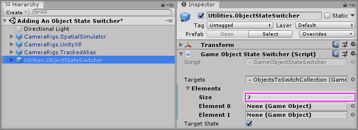
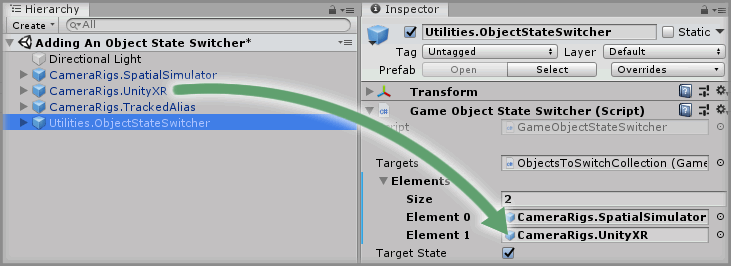

# Adding An Object State Switcher

> * Level: Beginner
>
> * Reading Time: 2 minutes
>
> * Checked with: Unity 2018.3.14f1

## Introduction

The `Utilities.ObjectStateSwitcher` prefab allows for the active state of multiple GameObjects to be switched between via a screen space user interface.

In this guide, we'll learn how to use the ObjectStateSwitcher prefab to manually switch between different CameraRigs within the scene.

> The Object State Switcher will persist across different loaded scenes. If you require multiple Object State Switchers in your scene then make sure they have slightly different GameObject names otherwise they will share the same selected index.

## Prerequisites

* [Add the Tilia.CameraRigs.TrackedAlias.Unity -> CameraRigs.TrackedAlias] prefab to the scene hierarchy.
* [Install the Tilia.Utilities.ObjectStateSwitcher.Unity] package dependency in to your [Unity] project.

## Let's Start

### Step 1

Add a `Utilities.ObjectStateSwitcher` prefab to the Unity project hierarchy by selecting `GameObject -> Tilia -> Prefabs -> Utilities -> Utilities.ObjectStateSwitcher` from the Unity main top menu.

### Step 2

Select the `Utilities.ObjectStateSwitcher` GameObject in the Unity Hierarchy window then increase the `Targets -> Elements -> Size` property by `2` on the `Game Object State Switcher` component.

> The size property will be `0` by default so change it to `2`.

### Step 3

Drag and drop the `CameraRigs.SpatialSimulator` GameObject from the Unity Hierarchy window into the newly displayed `Element 0` field within the `Target` property on the `Game Object State Switcher` component.

### Step 4

Drag and drop the `CameraRigs.UnityXR` GameObject from the Unity Hierarchy window into the newly displayed `Element 1` field within the `Target` property on the `Game Object State Switcher` component.

Ensure both CameraRigs are active in the scene as the Object State Switcher prefab will ensure only one is active at runtime.

### Done

Now you have the ability to switch to your preferred CameraRig at runtime via the Object Switcher UI Panel displayed on the Unity Game view. If you play the Unity scene, you will see that the Object Switcher UI is located in the upper right of the Unity Game view and the `CameraRigs.SpatialSimulator` GameObject has been activated in the scene whereas the `CameraRigs.UnityXR` GameObject has been automatically disabled.

Now unlock the mouse pointer from the Unity Game window by pressing the Lock toggle button on the Spatial Simulator (`6` by default) and click on the `CameraRigs.UnityXR` button within the `Object Switcher` UI Panel. The `CameraRigs.UnityXR` will switched to and become the active GameObject in the scene and therefore the `CameraRigs.SpatialSimulator` will become deactivated.

[Add the Tilia.CameraRigs.TrackedAlias.Unity -> CameraRigs.TrackedAlias]: https://github.com/ExtendRealityLtd/Tilia.CameraRigs.TrackedAlias.Unity/tree/master/Documentation/HowToGuides/AddingATrackedAlias/README.md
[Install the Tilia.Utilities.ObjectStateSwitcher.Unity]: ../Installation/README.md
[Unity]: https://unity3d.com/